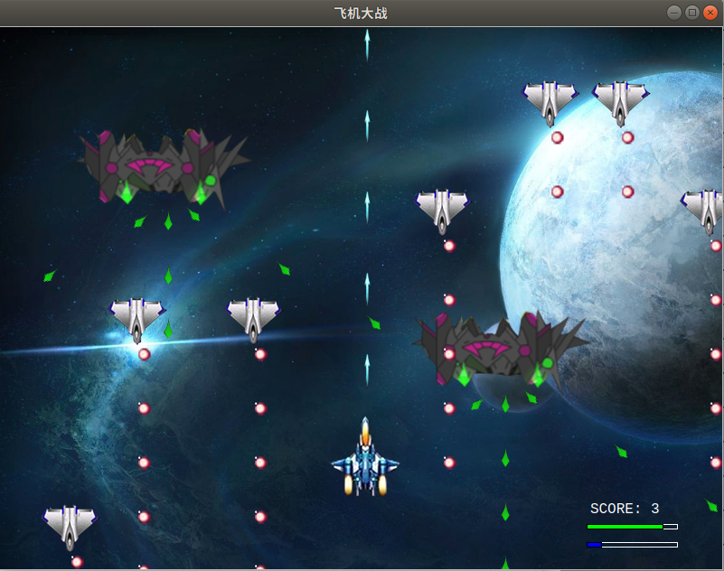
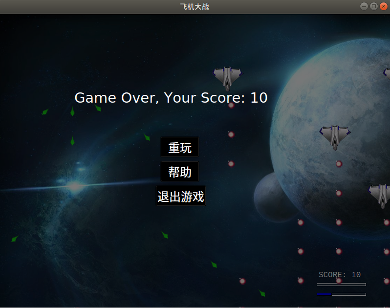

# GamePlatform(游戏平台)

[](https://github.com/Sanzona/GamePlatform/stargazers)  [](https://github.com/Sanzona/GamePlatform)  [](https://github.com/Sanzona/GamePlatform/commits/master)


QT实现一个简单的游戏平台


1. 参照[数据库文档]([https://github.com/Sanzona/GamePlatform/blob/master/%E6%95%B0%E6%8D%AE%E5%BA%93%E6%96%87%E6%A1%A3.md](https://github.com/Sanzona/GamePlatform/blob/master/数据库文档.md))添加数据库

   

   

   

   

2. 修改```dbHelper.cpp```, 配置对应的数据库

   

   

3. 注册用户

   

   

4. 登录游戏大厅

   

   

   

5. 五子棋游戏

      

      

      

      

6. 飞机大战游戏

      

      


7. 个人信息

   

8. 游戏排名

   

   